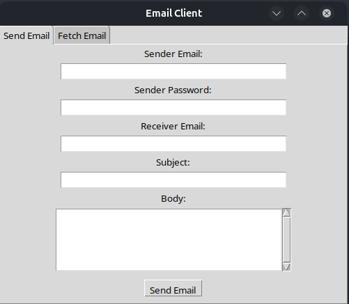
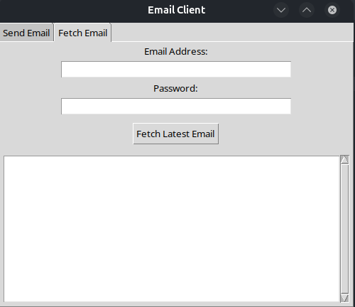

# Email Client

## Overview

This project is a simple Email Client that allows users to send and fetch emails using a GUI interface built with Tkinter. The client uses Gmail's SMTP and IMAP servers to send and retrieve emails securely.

## Features

- **Send Emails**: Users can send emails through Gmail SMTP.
- **Fetch Latest Email**: Retrieves the most recent email from the user's inbox.
- **GUI Interface**: A user-friendly Tkinter-based interface for sending and receiving emails.
- **Error Handling**: Provides detailed error messages for common email-related issues.
- **Multithreading Support**: Prevents UI freezing while fetching emails.

## Requirements

- Python 3.x
- Gmail account (with an app-specific password if 2FA is enabled)
- The following Python libraries:
    - `smtplib`
    - `imaplib`
    - `email`
    - `socket`
    - `ssl`
    - `tkinter`
    - `threading`

## Installation

1. Clone the repository:
   ```sh
   git clone https://github.com/Noureldeen73/Email-Client
   cd email-client
   ```
2. Install required dependencies (if needed):
   ```sh
   pip install tk
   ```

## Usage

### Running the Email Client

Execute the following command to start the GUI:

```sh
python Gui.py
```

### Sending an Email

1. Open the application.
2. Navigate to the "Send Email" tab.
3. Enter your Gmail credentials (email & app password).
4. Enter the recipient's email, subject, and body.
5. Click "Send Email" to send the message.

### Fetching the Latest Email

1. Navigate to the "Fetch Email" tab.
2. Enter your Gmail credentials (email & app password).
3. Click "Fetch Latest Email" to retrieve the most recent email.
4. The email's subject, sender, and body will be displayed in the text area.

## Code Structure

- `email_utils.py`: Contains functions to send and fetch emails.
- `Gui.py`: Implements the Tkinter GUI for interacting with email functions.
- `config.py`: Stores configuration settings (optional).

## Troubleshooting

- If authentication fails, ensure you use an app-specific password if you have 2FA enabled.
- If emails are not being retrieved, check if IMAP is enabled in Gmail settings.
- If connection issues persist, verify internet connectivity and allow less secure apps access in your Gmail settings.
- If the UI freezes while fetching emails, restart the application and ensure threading is correctly implemented.

## GUI Screenshot

### Send Email Tab


### Fetch Email Tab


